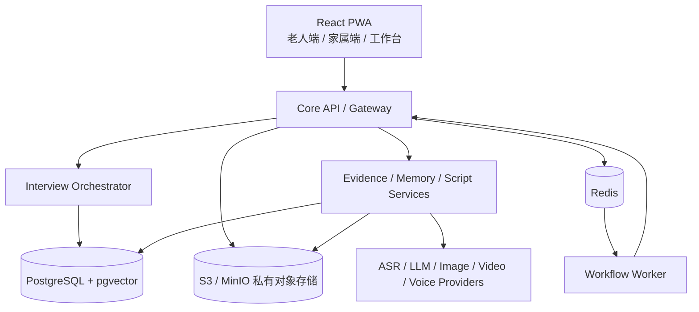

# 总体架构

## 1. 目标形态

当前采用“Core API + 明确服务边界 + 独立 Workflow Worker”的渐进式微服务架构。身份、采访、证据、记忆、剧本、授权和发布在过渡期共享 PostgreSQL 实例，但各自拥有明确的表与服务函数；实时采访编排和长耗时媒体生产通过 Redis 交给 Worker。达到明确的并发或组织边界后，优先把 Interview Orchestrator、Evidence、Script 与 Production 拆成独立进程和数据库。

## 2. 领域边界

| 模块 | 职责 |
|---|---|
| Auth / Identity | 账号、会话、租户成员、人物和关系 |
| Interview | 章节、采访会话、轮次、问题规划 |
| Interview Orchestrator | Turn 幂等、处理状态、信息缺口与跨服务编排 |
| Evidence | 媒体、逐字稿、片段、版本与哈希 |
| Memory | 主张、实体、关系图谱、时间线、矛盾和覆盖度 |
| Script | 人物剧本、章节、镜头和持续版本更新 |
| Governance | 肖像、声音、制作、发布和监护授权及审计 |
| Production | Provider 任务、费用、FFmpeg 合成与生成资产 |
| Publication | 家庭/朋友/公开独立构建与撤回 |

## 3. 数据原则

1. 原始证据只追加版本，不被 AI 输出覆盖。
2. `Claim` 是可引用、可冲突、可撤回的事实单元。
3. 所有查询必须带租户边界。
4. 生成资产必须记录输入版本、Provider、模型、费用和输出哈希。
5. 对外内容按目标受众独立构建并校验授权，不在同一份完整内容上做运行时隐藏。

## 4. Provider 设计

业务层使用统一接口：

- `capabilities()`
- `estimate(request)`
- `submit(request, idempotency_key)`
- `get_status(provider_job_id)`
- `cancel(provider_job_id)`
- `fetch_outputs(provider_job_id)`

当前代码包含五类确定性 Mock Provider、OpenAI-compatible LLM/ASR，以及已接入生产 Worker 的通用异步媒体适配器。可通过 `GET /v1/providers` 查看能力和配置状态。外部视频输出可通过下载 URL 或 Base64 返回，系统下载后写入私有存储并记录哈希。

## 5. 当前可运行的数据链路

```mermaid
flowchart LR
    PERSON[人物 Person] --> SESSION[采访 InterviewSession]
    SESSION --> ROUND[问答 InterviewRound]
    ROUND --> TURN[持久化 Turn 工作流]
    TURN -->|素材分析 / ASR| OBSERVATION[证据 Observation]
    TURN -->|保留 source_round_id 与原话| CLAIM[记忆 MemoryClaim]
    OBSERVATION -->|保留 source_observation_id| CLAIM
    CLAIM -->|保留 source_claim_ids| SCRIPT[剧本 ScriptProject]
    SCRIPT --> SCENE[场景 ScriptScene]
    SCENE --> CONSENT[制作 / 肖像 / 发布授权]
    CONSENT --> JOB[幂等视频生产 Job]
    JOB --> ASSET[私有生成资产]
    ASSET --> PUBLICATION[分受众发布 / 撤回]
```

每次文字、语音或素材提交都会创建 `interview.turn.process` 工作流。Worker 依次完成素材分析、记忆编译、AI 语义缺口判断、结构化 `ScriptUpdateBrief`、当前章节剧本与镜头更新，再写入 AI 生成的下一条追问。Mock 模式保留确定性实现用于测试；OpenAI-compatible 真实模式禁止规则降级，采访、记忆、视觉或剧本模型失败时记录领域错误码并由用户重新提交任务。无论使用何种 Provider，都不得覆盖原始证据或移除来源引用；当前章节会随新增采访持续重写为唯一最新稿。

## 6. 身份与流量边界

- 浏览器经 Web Nginx 同源访问 API；Nginx 注入内部 `X-API-Key`。
- 用户身份由签名的 HttpOnly 会话 Cookie 提供，租户与角色每次请求从数据库成员关系确认。
- Worker 使用 API Key 与显式 `X-Tenant-ID` 调用内部执行接口。
- 发布令牌只开放最小发布元数据和对应成片，不开放人物、记忆、逐字稿或素材列表。
