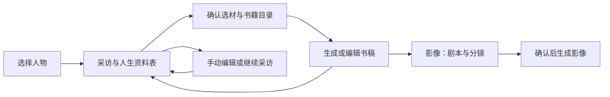

# 人生资料表、写书与影像流程改造计划

日期：2026-10-08。状态：用户已批准，三个阶段已实施并完成首轮生产发布；追加三轮顺序核验见[修正记录](../reports/2026-10-08-life-profile-three-pass-audit.md)，后续版本以实际运行记录为准。

本计划与[人生资料表模板](2026-10-08-life-profile-template.md)已获用户授权实施。验收证据和人工待测项见[实施与验证记录](../reports/2026-10-08-life-profile-release.md)。此前的写书服务计划继续作为历史记录；本计划实施后，以这里定义的新素材来源和流程为准。

## 1. 核心决定：采访不分章节，作品仍保留章节

取消新采访中的固定人生章节、章节切换和采访自动生成剧本。一位人物只有一份持续更新的人生资料表，AI 围绕空缺、矛盾和用户当前想聊的内容进行采访。表格按资料类别折叠展示，可以跨类别聊天，不要求从出生顺序答到现在。

“整个人生的采访”指统一的资料范围，不是一次聊完。用户可以随时离开、下次继续，也可以只讲某段经历。每次会话读取必要的当前资料与近期对话，不把全部人生对话无上限塞进模型上下文。

写书保留独立目录和章节，每章目标约 1000 字，继续采用现有 900–1100 个正文有效字符的生成验收范围。资料足够时先建议 3–8 章的小书；资料只支撑 1–2 章时如实提示，不凑章节、不编经历。目录、标题、顺序和选材范围可以由用户调整，书章不再依附采访章节。

影像中的“本章剧本”改为“剧本与分镜”。用户先选择已保存书稿及改编范围，再生成影视剧本和分镜，审核后另行启动影像生成。可以改编一个书章、几个书章或整书，但不直接将整个人生自动转换成长视频。

## 2. 现有耦合与改造位置

| 范围 | 当前行为 | 本计划中的调整 |
| --- | --- | --- |
| Web 采访列表与房间 | 选择采访章节，长期对话绑定章节；房间显示剧本和生成状态 | 人物级采访入口；聊天旁展示资料表、缺项和可写范围 |
| 采访编排与实时语音更新 | 调用记忆与剧本技能，按章评估素材 | 更新资料、处理更正、判断写作素材，停止采访内剧本生成 |
| 写书服务 | 目录来自采访章节，读取章节记忆 | 独立目录，读取资料表快照及对应证据 |
| 剧本服务 | 场景与采访章节关联，一个章节的场景受现有唯一约束限制 | 绑定书稿版本；一个书章允许多个场景和镜头 |
| 影像工作台 | 展示“本章剧本”并制作视频 | 选择书稿，生成、编辑剧本和分镜，再制作视频 |
| 小程序 | 首页、采访、制作页仍使用章节或旧剧本入口 | 同步人物级资料与书稿流程，沿用相同后端规则 |

主要修改路径包括 `apps/web/src/pages/InterviewsPage.tsx`、`InterviewRoomPage.tsx`、`BooksPage.tsx`、`StudioPage.tsx`、`apps/web/src/components/AppShell.tsx`，以及 `services/interview`、`services/book`、`services/memory`、`services/script` 和 `packages/contracts`。小程序按现有 Taro/TSX 页面修改。

当前书章的 `chapter_id` 是非空外键，采访会话与剧本场景也保留章节关联，因此不能只隐藏切章按钮或直接删除章节表。迁移方案见第 10 节。

## 3. 用户流程与页面

Web 主导航调整为“家人 → 采访 → 写书 → 影像”。移除独立“剧本”导航，旧链接仍能找到对应历史作品。

采访页面在宽屏并列展示聊天与资料表；资料类别可折叠，顶端显示“已整理资料”和“可写内容”。用户可以直接修改某项、添加经历、选择“围绕这一项聊聊”，也可以打开完整表格。窄窗口切换聊天和表格，不新增强制填写向导。

达到写作条件时提示：“当前资料足以写作这些内容：……。可以前往写书，也可以继续补充。”不自动结束采访、不跳转、不启动收费任务。若只支撑局部内容，明确显示“这段经历可以写书，其他阶段仍缺资料”。

## 4. 人生资料表与编辑规则

详细字段、问题示例、经历记录结构和导出格式见[模板](2026-10-08-life-profile-template.md)。首版包含基本信息、家庭与成长、童年、学习、工作、亲密关系、照顾与养育、转折与选择、成就与价值观、当前生活、寄语、素材与创作偏好 12 类；类别不是采访章节。

基本身份优先复用人物资料，填写姓名或书中称呼即可。性别、精确生日、婚育、学历、退休经历均不强制。允许“不记得”“暂时跳过”“不愿回答”“不适用”，不询问身份证号、密码等无关数据。

一个人可以有多段学校、职业、关系和重要经历，每条记录有稳定 ID；不用一格长文覆盖所有事情。单条经历记录时间原话及精度、地点、相关人物、经过、本人行动、结果或影响、来源和使用范围。时间不明确时保留“约”“可能”“记不清”，不自动补成精确年份。

AI 提取与手动编辑进入同一份资料表，保存后立即刷新资料版本与写作状态。每次变更记录修改者、来源、旧值、新值和时间；界面展示当前有效值，历史保留用于追溯。

后续对话明确说“剧本/资料里年份错了，应是……”，应修正对应事实和相关时间线，关闭旧冲突或标记被更正。用户不必寻找第一轮回答并点击修改。关系对象不明确时只问必要的澄清；不能把更正误当成新增第二条经历。

同时编辑采用资料版本检查。AI 提交结构化变更前校验字段、来源和当前版本；版本冲突时重新读取相关字段，不以旧快照覆盖刚保存的手改。撤销或恢复旧值也产生新版本。

## 5. “已填写”与“足以写书”分开判断

| 指标 | 含义 | 展示与用途 |
| --- | --- | --- |
| 表格处理情况 | 适用项中有内容、未知、跳过或拒答的数量 | 展示具体缺项和已处理情况，不等同于素材充足 |
| 可写素材情况 | 在选定范围内，有来源的经历能支撑什么故事 | 展示可写主题、缺少的细节及建议书章 |
| 冲突与使用限制 | 当前事实有无未解决矛盾，是否允许写入作品 | 阻止受影响素材进入正文；不阻止其他可用素材 |

准备状态使用 `not_ready`、`partial_ready`、`ready`：没有可写内容、有部分可写主题、当前选定范围可进入写书。状态绑定资料版本、选材范围和规则版本；资料修改或用户改变范围后重新评估，过期结论不得继续显示为当前状态。

首版评估先检查称呼、范围、有效来源与使用许可，再判断每个建议书章是否有具体经过、本人行动和结果/影响。通常需要若干有关联的事件，或一件细节丰富的关键经历。只填“工作、结婚、努力生活”不通过；一件叙述充分的经历可以局部通过。准确年份不是硬门槛，但相互矛盾的关键事实不能未经处理进入作品。

AI 返回“可写主题、支撑条目、缺项、判断理由”，服务端校验条目存在、当前有效且可使用；不能仅靠模型一句“足够了”放行。拒答和不适用只算已处理，不充当内容。不得仅按聊天轮数、表格百分比、回答长度判定完成。

该状态表示可以尝试写作，不保证每章一定达到 1000 字。写作阶段仍执行字数、来源和事实验收，素材不足时返回具体补充问题，保留原稿。补问优先解决当前可写主题的关键缺项，拒答内容不反复追问。

## 6. AI、记忆与实时语音

沿用现有编排与技能方式，拆清职责，不增加一群独立聊天 Agent：

1. 采访规划：根据用户话题、缺项和提问历史选一个主要问题，避免重复追问。
2. 资料整理：从新回答提取字段、经历和明确更正，形成带来源的变更建议。
3. 记忆同步：将已接受资料投影到人物、事实、时间线与冲突记录，保留证据。
4. 素材评估：按当前范围判断可写主题，生成下一步提示。
5. 写书与影视改编：各由对应服务在用户主动请求时执行。

资料表是当前事实与使用范围的权威；记忆图谱负责关联、检索和证据。写书取资料快照，图谱补充内容必须映射到有效来源，不得用已被更正的历史回答覆盖资料。模型输出必须经过结构、权限、版本和证据校验后才写入。

文字、录音转写和实时语音共用资料整理与评估技能。实时语音异步处理可复用已有更新机制，不在每次语音更新后生成书稿或剧本。失败时标记“资料整理中/整理失败”，允许重试；用户听到的完成提示应与已持久化的资料版本一致。

跨会话保留必要的证据文本、转写片段、提问历史及更正记录，不能仅依赖实时语音的内存队列。原始录音是否保留仍遵守已有设置。先用模拟语音事件验证幂等、延迟、重连和保存状态；真实实时语音端到端体验留给用户手测，不宣称已通过。

## 7. 写书：独立目录与资料来源

写书页面先显示可用素材和建议目录。用户确认标题、顺序、叙述人称、读者和选材范围后，生成单章或批量生成。默认使用人物资料表；不是将表格原样拼接成正文，也不直接把对话记录当书稿。

每章保存独立 ID、标题、顺序、选材范围和关联资料条目。每个书稿版本保存正文、来源资料版本、条目 ID、内容摘要及必要快照；保留已有版本、编辑、任务重试和导出能力。章节删除、重排、修改选材不修改采访资料。

生成只使用当前允许写入的事实。未知性别、年龄、时间或细节不擅自补全，未提供的对白不能作为真实引语。素材不足返回缺项，不能编造以达到 1000 字。人工正文可以保存，字数偏离目标时提示，不禁止用户保留短稿。

资料更正后，仅标记依赖相关条目的书章“来源已更新”，由用户决定何时改稿；不能自动收费重写。用户手改书稿不会反向覆盖事实表，可通过单独的资料编辑修正事实。影视改编前检查书稿涉及的事实更正和使用限制，必要时提示先更新书稿。

## 8. 影像：从书稿生成剧本和分镜

“剧本与分镜”包含来源书稿选择、改编时长和要求、生成状态、剧情/场景/对白/旁白编辑、分镜预览。没有书稿时提供“前往写书”，不从采访后台自动补出剧本。

首版建议从一个主题生成 30–60 秒短片，可选多个书章或整书作为素材；时长是用户选择的成片目标，不按书章数量直接累加。生成剧本、生成图像和生成视频分开触发，避免一次点击连续产生多项费用。

沿用已有分步骤剧本生成和按分镜制作：先确定选材与主题，再规划场景/剧情，随后编排对白、旁白和镜头，最后校验事实、时长、约束和来源。镜头按供应商支持的时长生成，保留按镜头重试及人物一致性机制。

项目和场景明确引用所选书稿版本及段落范围，不使用“当前最新”作为不可追溯的动态来源。一个书章可拆多个场景，一个场景可以引用多个书章；镜头排序和来源均不依赖采访章节 ID。

继续保留每镜头的“不露脸”等视觉要求、稳定人物标识、人物参考资产、年代/地点和提示约束。书稿未提供性别时不得在分镜补成“中年女性”。用户提出的创作要求需显式记录到作品偏好或影像配置，不能只存在一轮聊天里。

书稿更新后，依赖它的剧本显示“来源有新版本”，旧剧本和视频仍可找到。资料隐私或作品使用授权收紧时阻止继续使用受限素材生成、分享或导出，保留记录供有权限的用户查看；不自动删除 OSS 历史文件。视频模型是否实际遵守不露脸等要求需另行评估，提示词检查不能替代成片检查。

## 9. 数据与服务设计

继续使用现有独立服务、一个 PostgreSQL 数据库、现有九个业务 Schema 和三个任务 worker，不为本次改造增加物理服务器或分库。资料表归采访服务，目录与书稿归写书服务，影视剧本归剧本服务，媒体任务和文件归媒体服务。

以下为拟定结构，字段名在实施时与现有命名统一：

| 数据对象 | 用途与约束 |
| --- | --- |
| `interview.life_profiles` | 租户与人物唯一；模板版本、当前资料版本、选材范围；准备结论绑定版本、范围和规则 |
| `interview.life_profile_entries` | 字段或重复记录的稳定 ID、类别/字段键/记录组、结构化值、处理状态、确定性、使用范围和来源 |
| `interview.life_profile_revisions` | 不可变变更记录，包含增删改、修改者、来源和前后值；可重建历史资料快照 |
| 既有采访会话与工作流 | 增加资料表、流程模式和版本关联；新会话不要求 `chapter_id` |
| 既有记忆与证据 | 增加资料条目与资料版本关联，支持更正、废弃事实和冲突关闭 |
| 既有书章与书稿版本 | 增加自有标题/顺序/选材；存资料来源快照；旧章节外键仅作历史兼容 |
| 既有剧本项目与场景 | 增加书稿来源类型、版本/片段与快照；场景不再由采访章节决定唯一性 |

不把资料状态塞进 `script_brief`，不为每个表格类别建一套服务或数据库表。照片、录音和成片实际仍在 OSS，数据库存资产标识、对象路径及关联信息，不存大文件正文。

现有 `(tenant_id, subject_id, chapter_id)` 会话唯一约束不能依靠空 `chapter_id` 保证新会话唯一。新流程以非空资料表 ID 关联；对同一资料表的活动人生会话增加适当的唯一约束，旧会话保留，可供新会话引用历史。新书章有自己的 ID；剧本场景通过场景 ID 和项目内顺序管理，解除一章只能一个场景的限制。

拟增加资料读取、带版本的批量编辑、缺项/准备状态、历史记录和导出 API；采访创建改用人物/资料表而非章节。写书目录编辑与生成接收资料版本和条目选择；剧本生成接收保存的书稿版本列表、片段、时长和作品要求。响应返回明确版本、来源、任务及错误状态，前端不自行猜测同步完成。

共享数据库不改变服务写入边界。跨服务通过已有受保护接口、任务或事件同步，复用持久队列、账本和幂等记录。事务提交后发事件；重复投递、重试和中途重启不得产生重复经历、双重扣费或状态倒退。书稿和剧本生成使用冻结的来源快照，完成时比较当前版本，避免任务过程中更正被旧结果覆盖。

## 10. 导出、计费与历史数据迁移

资料表首版提供 XLSX 和 Markdown 导出，包含当前有效事实、未知项、来源与使用范围，用户可以拿去自行写书。默认导出允许进入作品的内容，勾选私密资料时明确说明导出范围并校验权限。历史审计内容不默认混入正文素材；不导出密钥、临时签名链接。离线文件修改后重新导入不在首版范围，在线编辑是当前资料更新入口。

查看、手动编辑和导出不增加费用；AI 补问、整理、写书与改编复用现有文本模型计费规则。查清既有按章成功扣费及剧本生成计费分支，取消采访触发剧本的冻结/扣费路径，不能仅改名称后继续收取剧本费用。每项主动生成任务显示其费用规则，不新增未经确定的固定套餐。

迁移采用新增结构、回填、切换的方式：

1. 增加资料表、版本和来源字段，保留旧章节表与所有外键关系，不删除原始问答、记忆、书稿或媒体。
2. 为每个人物建立资料表，优先迁入当前有效、明确可映射的事实和更正；按稳定来源 ID 幂等导入，不能把被更正的旧答案再次变成当前值。
3. 无法安全映射的长回答保留为待整理素材，供用户继续采访或查看；旧剧本里的推测不是事实来源。禁止迁移时批量调用付费模型自动整理历史数据。
4. 为已有书章回填自有标题、顺序和原资料关联，保留书稿版本及快照；完成新约束后让旧采访章节关联可空，新书章不再依赖它。
5. 为已有剧本标记旧来源类型，不伪造书稿来源；旧视频不要求重制。新增作品必须经过保存书稿到剧本的链路。
6. 旧采访入口引导进入同一人物的新资料表，仍可查看原对话。旧剧本链接导向影像的历史作品；旧客户端请求旧自动生成行为时给出明确升级提示，不静默收费。

切换前盘点活动采访、录音、书稿、图像与视频任务；等待在途任务安全结束或使用版本化处理器完成旧任务。新任务记录流程版本，旧 worker 不得误消费新格式。只有三个阶段全部联调通过后才切换生产入口，避免半套流程在线运行。

回滚优先保留新增表与数据、回退入口和对应运行镜像，不执行破坏性降级。若已有新流程写入，不能直接恢复旧数据库备份而丢失用户新内容；需保留期间数据并验证旧程序兼容，否则仅暂停新增任务并修复向前。迁移需具备执行记录、重复执行保护和可核验的行数/关联校验。

## 11. 三个实施阶段

| 阶段 | 交付内容 | 进入下一阶段的条件 |
| --- | --- | --- |
| 第一阶段：资料与采访 | 模板/模型/迁移/API；资料编辑与证据；缺项规划、纠错、准备评估；文字/录音/语音协议适配；采访不再生成剧本 | 新人物、历史人物、拒答/未知、明确更正、并发编辑、跨会话续填通过；模拟链路没有剧本任务和相应扣费 |
| 第二阶段：资料驱动写书 | 自有目录；按资料选材、生成与编辑；来源快照、局部失效、导出；资料表 XLSX/Markdown | 约 1000 字生成边界、来源验证、目录重排、重复提交、失败保留旧稿及旧书章迁移通过 |
| 第三阶段：书稿驱动影像 | 改编书稿选择；剧本/分镜生成与来源；影像工作台与导航；小程序、旧链接、费用、任务事件和完整文档 | 从采访到影像的 Docker 联调、迁移一致性、授权与资源回归全部通过，未覆盖项有清单 |

三个阶段都在现有本地分支完成并验证，第三阶段包含完整整合，不在阶段之间上线中间状态。同步更新服务契约、模型注册、网关路由、Docker 打包、迁移加载和运维文档；架构文档按当前 Compose 校准，避免沿用旧服务/worker 数量。

未来执行发布仍遵循仓库流程：本地修改与验证 → 提交并推送 GitHub → 服务器校验干净工作区并获取同一提交 → 备份数据库与环境、保留旧镜像 → 迁移与更新受影响服务 → 验证运行代码、健康与版本。服务器 GitHub 不可达时使用已推送提交的校验 Git bundle，不直接改生产源码。最终记录提交、迁移版本、备份位置和实际容器验证结果。

## 12. 验收用例与证据

| 用例 | 必须观察到的结果 |
| --- | --- |
| 新人物开始聊天 | 无采访章节选择；一次回答可补多个类别，自动填写资料且显示来源 |
| 表格全是短答 | 已处理数量增加，但不能误报有完整书籍素材 |
| 丰富经历但其他阶段空白 | 显示局部可写的具体主题，允许只写该部分，不宣称全人生完成 |
| 后续明确更正年份/地点 | 更新同一经历、时间线和冲突状态；刷新后仍正确，没有重复事件 |
| 没提供性别、精确年龄 | 资料、书稿和剧本均不补出性别或“中年”等推断性形象 |
| 不适用/拒答/未知 | 不强迫婚育或经历，不反复追问，不用空内容凑字数 |
| 人工编辑与 AI 同时保存 | 旧版本提交不能覆盖新值，失败返回可恢复的状态 |
| 离开、重连或任务重启 | 当前资料、提问历史和更正仍存在，状态与持久化版本一致 |
| 采访完整填写 | 不生成剧本、不产生对应任务或计费；前往写书由用户点击 |
| 资料更正后已有书稿 | 只标记依赖的章节；原稿、其他章节和版本仍保留 |
| 书稿生成期间来源更正 | 原任务使用冻结来源；成稿明确标记过期，不覆盖新稿或冒充最新 |
| 保存书稿后生成剧本 | 来源版本和片段可追溯；一个书章可拆多个场景和镜头 |
| 视频要求和人物一致性 | 每镜头保留对应约束、人物 ID 与参考资产，重试不丢要求 |
| 权限变更与跨租户访问 | 受限内容不能被另一租户读取或用于新作品，撤回使用权后禁止新衍生任务 |
| 历史数据库迁移 | 原问答、书稿、资产、账本可核对；无悬空关联；再次回填不重复 |
| 导出 | XLSX 与 Markdown 的事实/未知/来源对应当前版本，不夹带旧错误、私密项或密钥 |
| 重复任务与供应商失败 | 幂等、重试、账本结算正确；失败不抹去已有作品 |
| Web 与小程序 | 使用同一资料版本、准备状态和来源约束，旧入口不会触发旧自动收费链路 |

代码测试使用隔离数据库、模拟模型和模拟外部供应商。数据库验证同时覆盖空库升级和带旧资料的升级，执行 `alembic check`、外键/唯一约束检查、模型加载与 PostgreSQL 集成验证，不能只用自动建表测试替代迁移验证。

本地 Docker 覆盖网关、受影响服务和三个 worker 的任务流；按总资源不超过单台 4 核 8GB 的基线记录延迟、错误率、队列积压和内存，观察采集/整理/写书任务竞争及重启恢复。并发上限依据测量确定，不预先承诺无限并发；付费模型限流与成片质量不能由 mock 压测证明。

Web 页面执行实际操作回归：聊天、编辑、状态刷新、目录、书稿版本、导出、剧本选择与分镜。小程序覆盖构建与共享契约；真实设备、平台发布、真实实时语音及真实模型文学/成片质量单列验收，不把模拟结果称为这些项目已经通过。

## 13. 首版范围与实施清单

本次计划不包含新支付渠道、书籍印刷、出版审核、离线表格回导、多数据库、重新制作全部历史视频，也不要求增加服务器。原有照片修复与媒体资产功能继续复用。

- [x] 确认资料模板和准备评估规则，建立版本化契约。
- [x] 完成第一阶段，验证资料权威、纠错和采访停止自动生成剧本。
- [x] 完成第二阶段，验证独立书章和导出。
- [x] 完成第三阶段，验证书稿改编、影像与小程序入口。
- [x] 完成隔离迁移、Docker、Web 及资源回归，记录人工待测项。
- [x] 按仓库发布流程同步与部署，记录运行版本、迁移和备份；首轮提交 `bdcac31daf8d`，迁移 `20261008_0044`。

代码、自动化测试与生产上线分开记录。未完成的验收和发布项不能因代码已实现而提前标记完成。
