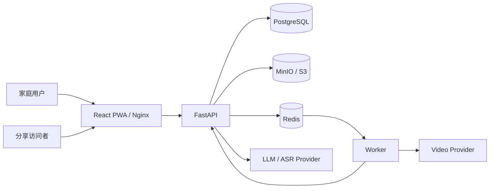
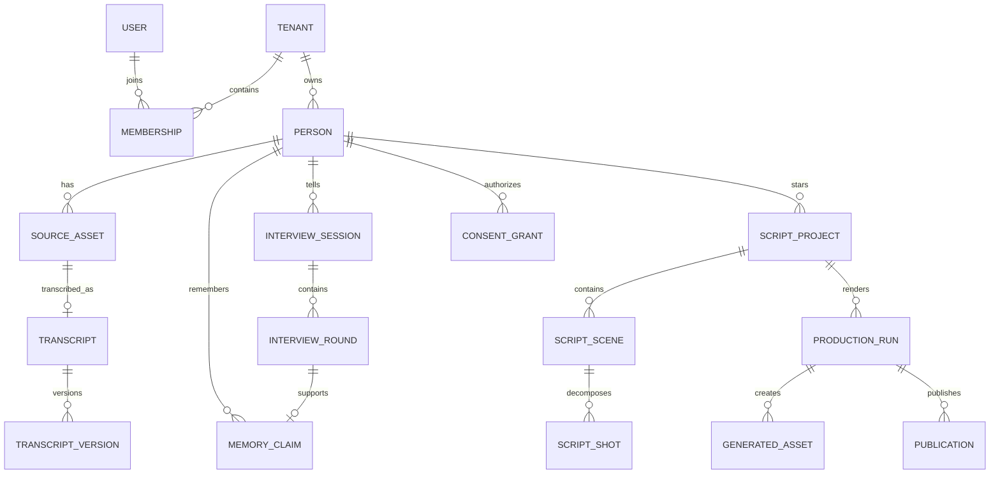
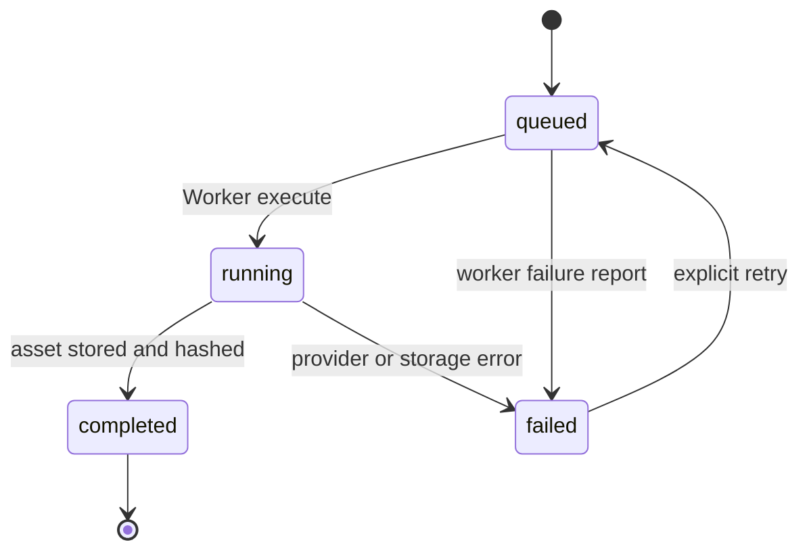

# 岁忆影传（LifeReel Biography）项目技术设计说明书

## 摘要

岁忆影传是一套面向个人与家庭的证据优先型 AI 口述史与自传短视频平台。系统通过渐进式采访获取人物生平，将录音、照片、视频、文档和逐字稿保存为不可被生成内容覆盖的原始证据，再将回答编译为可追溯的长期记忆。系统随采访持续生成第一人称自传短视频剧本，并在明确的制作与发布授权下通过本地 FFmpeg 或外部媒体 API 生产、发布和撤回成片。

系统借鉴长期陪伴产品的连续记忆与上下文追问思想，但不复制特定产品代码或品牌。核心差异是把最终成果从长篇自传文本改为单章节短片或多章节影传，同时把来源、隐私、肖像、声音、未成年人监护和发布范围作为一等领域对象。

关键词：口述史、长期记忆、自适应采访、证据链、自传短视频、生成式 AI、家庭隐私

## 1. 研究背景与问题定义

传统家族传记制作依赖一次性深度采访、人工整理和专业视频团队，成本高、周期长，也容易在转述时丢失原话。通用大模型虽能生成流畅故事，却存在事实混淆、来源丢失、隐私越界和人物形象未经授权等问题。

本项目要解决四个核心问题：

1. 如何让不熟悉复杂软件的讲述者通过短时、多次采访持续积累人生资料。
2. 如何把零散回答组织成带来源、可核对、可冲突处理的长期记忆。
3. 如何把记忆转化为适合 9:16 短视频的第一人称剧本，而不是普通长文。
4. 如何在生成与发布链路中落实人物授权、受众隔离和撤回能力。

## 2. 产品目标与边界

### 2.1 产品目标

- 提供低认知负担的章节化采访体验。
- 让追问依据历史回答、时间缺口、人物关系、感官细节和冲突动态产生。
- 保存原始媒体、逐字稿版本和每条事实的来源引用。
- 生成单章节或多章节的第一人称短视频剧本。
- 在没有付费 API 的环境中完成完整本地验收。
- 支持通过配置接入真实 LLM、ASR 和异步媒体生成服务。
- 默认私密，只有经过明确授权的构建才能发布给指定受众。

### 2.2 非目标

- 不将模型生成内容视为历史事实。
- 不自动公开用户素材或训练第三方模型。
- 不在缺少授权时进行声音克隆、真实肖像生成或公开发布。
- 不以当前规则抽取替代专业史料考证。
- 不承诺适配任意厂商的私有协议；非 OpenAI-compatible 服务需实现适配契约。

## 3. 用户与角色

| 角色 | 主要任务 | 权限 |
|---|---|---|
| 讲述者 | 接受采访、查看记忆与剧本、决定授权 | 由家庭成员代操作或本人操作 |
| 家庭 Owner | 管理家庭空间、人物、授权、生产和发布 | 全部读写权限 |
| Editor | 整理素材、校对逐字稿、编辑流程 | 业务读写权限 |
| Viewer | 查看家庭已授权内容 | 只读 |
| Worker | 执行内部异步任务 | API Key 与租户限定的内部权限 |
| 公开访问者 | 通过分享令牌观看某一发布版本 | 仅最小发布信息与对应媒体 |

## 4. 功能需求分析

### 4.1 身份与家庭空间

- 邮箱与密码登录，密码使用 PBKDF2-SHA256 加盐哈希。
- 登录令牌使用 HMAC-SHA256 签名并放入 HttpOnly Cookie。
- 用户通过 TenantMembership 关联家庭空间和角色。
- 服务端每次请求重新读取成员关系，角色变更可立即生效。
- 生产 Web 代理注入内部 API Key，前端 JavaScript 不持有系统密钥。

### 4.2 人物档案

- 保存姓名、称呼、出生年份、出生地、家庭关系和传记备注。
- 标识主要讲述对象。
- 标识未成年人并保存监护人姓名。
- 未成年人进入制作前必须存在匹配受众范围的监护授权。

### 4.3 AI 采访

- 内置 11 个生命章节：身份、来处、童年、求学、工作、爱情、亲长、坎坷、高光、现在、寄语。
- 支持创建、暂停、恢复和完成采访会话。
- 每个问题与回答形成 InterviewRound，可关联原始录音。
- 每章使用独立章节画像约束采访目标、关键词、必问主题和越界主题。
- 真实模式由采访 AI 语义判断缺口并生成一个开放式追问；请求或格式失败时显式报错并允许重试。
- 用户表达“不想说”“不方便”等边界时，系统不继续逼问原话题。

### 4.4 证据与逐字稿

- 浏览器通过 MediaRecorder 录制音频并作为私密证据上传。
- 支持音频、照片、视频、PDF 和文本。
- 上传时限制 MIME 类型和大小，使用 SHA-256 在租户内去重。
- 原始文件存入本地私有目录或 S3/MinIO，不通过静态目录公开。
- 支持人工逐字稿和 OpenAI-compatible ASR 转写。
- 每次人工修订创建新的 TranscriptVersion，旧版本保持不变。
- 每次素材分析创建新的 EvidenceObservation，记录素材、逐字稿版本、定位信息、置信度、Provider 与模型，不覆盖历史分析。
- 音频与视频先转写；视频可抽取关键帧；图片由视觉模型描述；PDF、TXT 与 Markdown 提取正文。

### 4.5 长期记忆

- 每个已回答轮次编译为 MemoryClaim。
- Claim 保存原话、来源轮次、采访、章节、置信度和隐私状态。
- 真实模式由记忆 AI 基于来源 Claim 提取人物、地点、组织及明确关系。
- 记忆 AI 提取年份和“小时候、后来、退休后”等相对时间锚点。
- 记忆 AI 语义判断来源之间的事实冲突并建立 MemoryConflict，不静默选择结论。
- 记忆 AI 根据全部可用 Claim 更新人物小传；任一步失败时整次整理回滚并允许重试。
- 统计章节覆盖率与待核对项目，供下一次采访规划使用。
- 采访回答和素材 Observation 都能生成 MemoryClaim；模型整理后的文字始终保留 source_quote 与来源 ID。

### 4.6 自传短视频剧本

- 支持单章节短片和多章节系列两种模式。
- ScriptProject 记录受众、来源 Claim 和持续更新版本。
- Scene 包含第一人称旁白、画面提示、时长与来源引用。
- Shot 将场景拆为建立镜头和细节镜头，可继续扩展更多镜头类型。
- 每个章节只保留一份当前稿件，并随该章新增采访内容持续优化。
- 画面提示要求符合年代与地域，不擅自生成未经授权的真实人脸。
- 真实 LLM 模式使用结构化 JSON 生成 Scene 与 Shot；服务端拒绝不存在或越权的 source_claim_ids。

### 4.7 视频生产

- 每次生产以项目、版本、受众和 Provider 组成幂等键。
- Mock 路径使用 FFmpeg 生成 H.264/AAC、720×1280、9:16 MP4。
- 外部路径通过通用异步媒体协议提交、轮询、取消并下载输出。
- Provider 输出写入私有存储，记录 SHA-256、参数、任务 ID 和成本字段。
- Redis Worker 消费任务并通过内部 API 更新统一 Job 账本。
- Worker 异常会回写 failed 状态和错误信息，支持失败任务重试。

### 4.8 授权、发布与撤回

- 支持 interview、portrait、voice、production、publication、guardian 六类授权。
- 授权按 private、family、friends、public 范围记录。
- 制作要求剧本至少包含一个章节，并存在制作与肖像授权。
- 非私密发布要求发布授权，发布受众必须与生产构建受众一致。
- 每个发布生成高熵访问令牌；公开响应不泄露人物和内部资产字段。
- 撤回后元数据和媒体端点立即不可访问，原始证据仍按合规流程保存。
- 授权、生产、发布和撤回均写入 AuditEvent。

## 5. 非功能需求

| 维度 | 设计要求 |
|---|---|
| 安全 | 默认私密、租户隔离、HttpOnly Cookie、内部 API Key、私有对象存储 |
| 真实性 | Claim 与 Scene 必须保留来源引用，冲突显式展示 |
| 可用性 | 无外部密钥时可完成本地闭环；移动端无横向溢出 |
| 可恢复性 | PostgreSQL 和对象存储备份；Redis 任务可基于账本重建 |
| 幂等性 | 素材按哈希去重，生产按稳定键去重，Provider 使用幂等键 |
| 可替换性 | LLM、ASR、图像、视频、语音经 Provider 边界接入 |
| 可观测性 | health、ready、system-status、任务状态、错误码和审计事件 |
| 合规 | 明确授权范围、未成年人监护、发布撤回、数据删除独立流程 |

## 6. 技术栈

### 6.1 前端

| 技术 | 用途 |
|---|---|
| React 19 + TypeScript | 页面和组件 |
| Vite 7 | 开发服务器与生产构建 |
| React Router | 应用与公开观看路由 |
| TanStack Query | 服务端状态、缓存和失效 |
| Lucide React | 一致的界面图标 |
| MediaRecorder API | 浏览器录音 |
| Vitest + Testing Library | 组件测试 |
| PWA Manifest + Service Worker | 安装与离线应用壳 |
| Nginx | 静态资源、SPA 回退和同源 API 代理 |

### 6.2 后端与数据

| 技术 | 用途 |
|---|---|
| Python 3.12 | API 与 Worker 运行时 |
| FastAPI + Pydantic | HTTP API、校验和 OpenAPI |
| SQLAlchemy 2 | 领域模型和事务 |
| Alembic | 版本化数据库迁移 |
| PostgreSQL 16 + pgvector 镜像 | 生产事务库与未来向量扩展 |
| SQLite | 快速测试和无容器开发 |
| Redis | 异步任务队列 |
| S3 / MinIO | 私有证据与生成资产 |
| FFmpeg | 本地 9:16 MP4 合成 |
| httpx | 外部 Provider 和内部 Worker 请求 |
| Pytest + Ruff | 后端测试和静态检查 |

### 6.3 工程与部署

- pnpm workspace 管理 Web 与共享契约。
- Docker Compose 编排 API、Web、Worker、PostgreSQL、Redis 和 MinIO。
- 三个独立 Dockerfile 控制服务镜像边界。
- GitHub Actions 验证 Ruff、Pytest、迁移、前端 lint/test/build、Worker 编译和 Compose 配置。

## 7. 系统架构与模块依赖



模块化单体让人物、证据、记忆、授权和剧本更新共享事务边界；Worker 只承担长耗时、可重试的外部工作。这样在项目早期避免分布式事务，同时保留未来按 Production、Media 或 Search 拆分的接口。

## 8. 项目结构

```text
LifeReel-Biography/
├─ apps/
│  ├─ api/
│  │  ├─ alembic/                 # 0001-0011 数据库迁移
│  │  ├─ src/lifereel_api/
│  │  │  ├─ core/                 # 配置、数据库、安全、租户、种子
│  │  │  ├─ modules/              # auth/evidence/governance/identity/
│  │  │  │                        # interview/jobs/memory/production/
│  │  │  │                        # publication/script
│  │  │  └─ providers/            # Mock、OpenAI-compatible、通用媒体
│  │  └─ tests/                   # API 与领域闭环测试
│  ├─ web/
│  │  ├─ public/                  # PWA manifest 与 service worker
│  │  └─ src/
│  │     ├─ api/                  # 类型化 API 客户端
│  │     ├─ components/           # 应用壳和公共组件
│  │     ├─ hooks/                # 录音 Hook
│  │     └─ pages/                # 人物、采访、素材、记忆、影传等页面
│  └─ worker/                     # Redis 消费者与任务回写
├─ packages/contracts/            # 前端共享 TypeScript 契约
├─ docs/                          # 架构、API、部署、ADR 与本说明书
├─ .github/workflows/ci.yml       # 持续集成
├─ compose.yaml                   # 本地/单机部署
└─ .env.example                   # 配置模板
```

## 9. 核心数据模型



来源链为 `SourceAsset / InterviewRound → MemoryClaim → ScriptScene / ScriptShot → ProductionRun → GeneratedAsset → Publication`。任意成片场景都能反向定位支撑它的采访原话。

## 10. 关键逻辑分析

### 10.1 自适应追问逻辑

```text
章节画像 + 本章对话 + 本章记忆 + 本章冲突
  → 采访 AI 语义判断最多四个信息缺口
  → 采访 AI 围绕最高价值缺口只生成一个问题
  → 成功后保存下一轮问题
  → 失败时保留当前记录并返回错误码，等待重试
```

章节首问、用户授权、隐私范围和来源校验仍由确定性代码控制；内容理解与生成在真实模式下不使用固定规则降级。

### 10.2 记忆编译

1. 按租户和采访筛选已回答轮次。
2. 通过 `source_round_id` 跳过已经编译的轮次。
3. 记忆 AI 整理 Claim，并复制原话为 source_quote。
4. 记忆 AI 生成实体、明确关系、时间锚点和事实冲突的完整快照。
5. 记忆 AI 更新人物小传。
6. 所有结果校验成功后一次提交；失败则回滚并等待任务重试。

### 10.3 剧本生成

1. 校验人物和可用 Claim。
2. 按单章/多章模式选择来源记忆。
3. 生成第一人称场景旁白与时代约束画面提示。
4. 为每个场景创建 Shot 和 source_claim_ids。
5. 替换对应章节的当前稿件并增加项目版本号。
6. 剧本存在章节且制作与肖像授权齐全后可进入生产。

### 10.4 异步生产状态机



生产幂等键包含项目 ID、剧本版本、受众和 Provider。重复请求返回同一个 ProductionRun，避免重复计费。

### 10.5 发布安全

发布服务不直接暴露私有 storage_key。访问令牌先查询状态为 published 的 Publication，再查询其唯一最终资产并从私有存储读取。撤回将状态改为 withdrawn，后续元数据和媒体请求均返回 404。

## 11. API 与 Provider 契约

完整路由见 [API 概览](api.md) 和运行时 `/docs`。外部异步媒体服务需实现：

| 动作 | 默认路径 | 最小响应 |
|---|---|---|
| 提交 | `POST /jobs` | `id`/`job_id`/`task_id` 与 status |
| 查询 | `GET /jobs/{id}` | ID 与 status |
| 取消 | `POST /jobs/{id}/cancel` | ID 与 status |
| 输出 | `GET /jobs/{id}/outputs` | URL 或 Base64 内容、MIME、扩展名 |

提交请求包含 kind、inputs、options，并携带 `Idempotency-Key`。生产服务接受 completed、succeeded、success 为成功终态；失败和超时会进入任务失败状态。

## 12. 安全与隐私设计

- 密码不明文保存，令牌密钥和 API Key 不进入仓库。
- 登录响应不向 JavaScript 返回会话 Token。
- 生产 Cookie 应启用 Secure；本机 HTTP Compose 可显式关闭用于验收。
- 所有业务查询显式带 tenant_id 条件。
- 文件名经 Path.name 处理，存储键由 UUID 与哈希组成并校验目录穿越。
- MinIO Bucket 禁止匿名访问；目标对象存储支持 SSE/KMS 时可显式开启服务端加密标志。
- 分享令牌使用 `secrets.token_urlsafe`，撤回后立即失效。
- 第三方 Provider 的输出下载仅在同主机时携带 Provider Authorization，避免凭据泄漏到外部 URL。
- 日志和公开响应不返回原始证据、密码哈希、会话 Token 或对象存储键。

上线前还需要组织层措施：隐私政策、数据处理协议、供应商训练使用审查、跨境传输评估、数据保留周期、删除请求和安全事件响应。

## 13. 测试与质量保障

自动化测试覆盖：

- 健康检查、Provider 能力与生产 API Key。
- 登录 Cookie、租户角色和只读成员限制。
- 人物、采访、智能追问和拒答边界。
- 证据去重、下载、ASR 转写和逐字稿版本。
- 记忆幂等、实体、时间线、冲突与剧本来源。
- 剧本持续更新、授权闸门、生产幂等、成片读取。
- 通用视频 Provider 异步契约。
- 发布最小响应、受众匹配、媒体访问和撤回失效。
- 前端首页渲染、TypeScript、ESLint 和生产构建。
- 从空数据库执行全部 Alembic 迁移。

合并前标准命令：

```powershell
cd apps/api
ruff check .
pytest -W error
alembic upgrade head

cd ../..
pnpm -r lint
pnpm -r test
pnpm -r build

cd apps/worker
python -m compileall -q src
```

## 14. 部署与运维

单机版本由 Docker Compose 提供 PostgreSQL、Redis、MinIO、API、Worker 和 Web。首次启动执行迁移和幂等种子，创建 11 个章节及配置指定的首位 Owner。

上线必须完成：

1. HTTPS 与 `AUTH_COOKIE_SECURE=true`。
2. 独立随机的 API Key、会话密钥、管理员密码和 MinIO 密码。
3. PostgreSQL 与对象存储备份及恢复演练。
4. `/health`、`/ready`、`/system-status`、队列积压和 Provider 失败率监控。
5. 容量、费用、频率、文件大小和公开发布策略。
6. 真实 Provider 的沙箱联调、超时、限流、重试和账单核对。

详细步骤见 [部署说明](deployment.md)。

## 15. 当前完成度与后续演进

当前版本完成了可运行的业务闭环与无密钥验收路径。外部密钥、域名、短信/邮件、电子签名和监控渠道属于部署配置或第三方服务，并非仓库可内置的凭据。

建议后续按实际使用数据演进：

- 使用 pgvector 增加语义召回，但保留来源过滤与权限过滤。
- 将当前单条 LLM Claim 整理扩展为多候选拆分、合并建议和批量人工确认。
- 增加脚本可视化编辑、版本比较和逐镜头重生成。
- 为特定视频供应商实现签名 Webhook，减少长轮询。
- 增加配音、字幕、音乐和多轨时间线合成。
- 增加成员邀请、多因素认证、密码重置和会话撤销表。
- 增加真实浏览器端到端测试、负载测试、对象存储故障注入和恢复测试。

这些演进不会改变最重要的不变量：原始证据不可被 AI 覆盖，生成事实必须可追溯，授权必须先于制作和发布，撤回必须立即停止访问。
